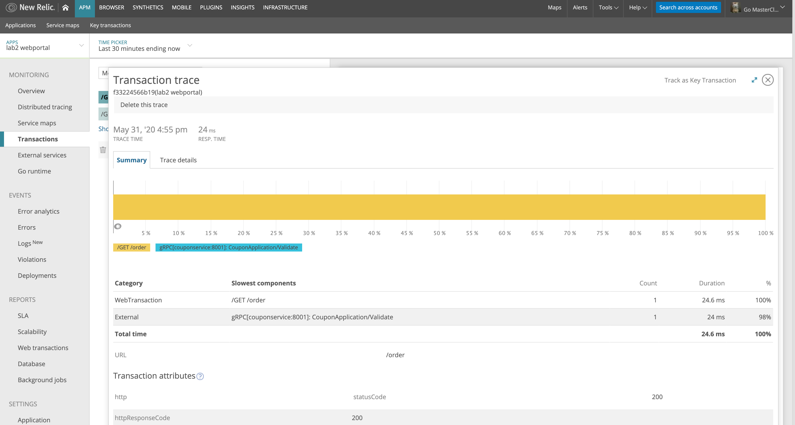

# 目次 {ignored=true}

<!-- @import "[TOC]" {cmd="toc" depthFrom=2 depthTo=3 orderedList=false} -->

<!-- code_chunk_output -->

- [はじめに](#はじめに)
  - [推奨ステップ](#推奨ステップ)
  - [ベストプラクティス](#ベストプラクティス)
- [準備](#準備)
- [基礎編](#基礎編)
  - [Go Agentのインストールと設定](#go-agentのインストールと設定)
  - [エージェントのログ出力](#エージェントのログ出力)
  - [(オプション) 環境変数による設定](#オプション-環境変数による設定)
  - [最初の計測](#最初の計測)
  - [カスタム属性や特別なトランザクション](#カスタム属性や特別なトランザクション)
  - [より簡単に計測する](#より簡単に計測する)
  - [segmentsの導入](#segmentsの導入)
  - [外部呼び出し](#外部呼び出し)
- [発展編](#発展編)
  - [goroutineの計測](#goroutineの計測)
  - [Integrationの利用](#integrationの利用)
  - [ハンズオン](#ハンズオン)
- [リンク](#リンク)

<!-- /code_chunk_output -->

## はじめに

New Relic Goエージェントは他のNew Relicエージェントとは異なり設定不要の自動インストゥルメンテーションを行いません。Go 言語の性質上、Java、.NET、Node.js、PHPなどが持っている動的なランタイムやメソッドの置き換えをGo は許可していません。これには独自の利点がありますが、それゆえGoアプリケーションを監視するにはコードの変更が必要です。肯定的に捉えると、コードの中で何を計測するかを100%制御でき、高度にカスタマイズ可能です。隠れた、奇妙な、あるいは意地悪なサプライズはありません。
さらに、New Relic Goエージェントにはパッケージの依存関係やバージョンがありません。Go開発者なら誰でも、Goエージェントに直接変更を加えることができます。このGoマスタークラスは、ベストプラクティス、レコメンデーション、コードデザイン、ガイドラインを集めたものです。このプログラムは、当社のNew Relic Goチームと大規模な本番環境で動作するGoアプリケーションを対象としています。基本的なセットアップ、最初の関数のインストルゥメント、ラッパーの記述から始めることができるように設計されています。ミドルウェア、分散トレース、gRPC、Logs in Context(LiC)などの新機能にも焦点を当てています。
これらは、Goアプリケーションをより早く使いこなすためのアドバイスに過ぎないことにご注意ください。これらNew Relic Goエージェントの機能の使用方法については、自由に変更してください。お客様の環境に合わせて最適なものをお選びください。

### 推奨ステップ

- GitHubの「Getting Started Guide」から始めましょう。アプリをインストルメントする前に、提供されている残りのGoドキュメントと参照リンクを参照してください。
- 「[発展編](#発展編)」セクション、特に「セグメント」のトピックを試す前に「[基礎編](#基礎編)」セクションの全てを確認してください。
- GoアプリがNew Relicで正常に監視されると、[カスタム属性](https://docs.newrelic.co.jp/docs/agents/go-agent/instrumentation/go-agent-attributes)を使用してより意味のあるデータを取得することができます。
- New Relic APMエージェントに[Kubernetesのメタデータ](https://docs.newrelic.co.jp/docs/integrations/kubernetes-integration/link-your-applications/link-your-applications-kubernetes)を注入することもできます。

### ベストプラクティス

- New Relic Goエージェントは5秒ごとにデータを送信していますが、UIにデータが表示されるまでに時間がかかります。動画にあるように、Goアプリをテストする際には、より多くのデータを生成することをお勧めします。
- 重要なキートランザクションを取得するために、モジュール式で拡張性があり、拡張性のあるラッパーを設計するのに時間をかけるのがベストです。
- アプリの最も重要な部分のみをインストルメントすることをお勧めします。Goアプリのすべての部分をインストルメントするのに膨大な時間を費やしてしまうと、時間を無駄にしてしまいます。重要なものだけをインストルメントしてください。
- 覚えておくべき重要なセグメントは3つあります：基本セグメント、外部呼び出しセグメントとデータストア・セグメントです。
- Goセグメントを開始するたびに、Goセグメントを終了することを忘れないでください。
- Goで分散トレースを使用して、他のプログラミング言語で書かれた既存のアプリケーションと接続することができます。Logs in Context (Go) を利用するためには、既存のログ転送装置が必要です。
- 重要> Go Agentの初期テスト段階でデフォルトの [Apdex 値を 0.001に設定](https://docs.newrelic.co.jp/docs/apm/new-relic-apm/apdex/change-your-apdex-settings)してください。アプリケーションが運用フェーズに入ったら、運用環境の値を反映するようにApdex の設定を再確認します。

## 準備

- goの開発環境 (この手順書はv1.14.2を使って動作確認しています)
- New Relic APM Proを有効にしたアカウント。ライセンスキーを取得して参照できる様にしておいてください。

## 基礎編

### Go Agentのインストールと設定

New Relic Go Agentの最新メジャーバージョンは3です。バージョン3よりモジュール化されています。今までのバージョン指定のないパスは互換性のためにバージョン2を参照するので、バージョン3を利用する場合は`github.com/newrelic/go-agent/v3/newrelic`と指定する必要があります。

New Relic Go AgentはHTTPのルーティング(webサーバー)、データベース呼び出し、その他のSDKを計測するためにそれぞれに対応するIntegrationライブラリをだしています。基礎編ではそれらのライブラリを使わず、シンプルなものを書き下す形から始めます。これにより、Integrationライブラリの適用の仕方がわかりやすくなると共に、ライブラリの利用方法がNew Relicの提供する手順と異なっていたり、提供していないライブラリを利用していたりする場合に、計測のためのコードを書くことができる様になります。

さて、まずシンプルなWebサーバーを`./lab1/main.go`に用意しています。この中には、sleepして応答するだけの`index`と`hoge`という２つのエンドポイントと、外部サービスを呼び出す`external`というエンドポイントがあります。これを計測するのが基礎編の目標です。計測したい内容は次の通りです。

- エンドポイントごとに呼び出し数と処理時間を計測する
- customerLevelというクエリ文字列で渡される顧客クラスをエンドポイントの統計に追加する(クエリ文字列を使うのはブラウザでテストしやすくするため)
- hogeエンドポイントでは無名関数内の処理の経過時間を個別に計測する
- 外部呼び出しを計測する
- エラーが発生した時に記録する

`./lab1/main.go`を編集して作業を進めるため、最初の内容を確認したい場合は`./lab1_materials/main.go.start`を参照してください。

それでは早速始めましょう。まずはGo Agentを設定してAPMのUIにアプリが表示されることが目標です。

まず、`github.com/newrelic/go-agent/v3/newrelic`をimportに追加します。またこの後利用するので、`os`も追加します。

```go
import (
  //略
  "os"
	"github.com/newrelic/go-agent/v3/newrelic"
)
```

`main`関数の先頭でGo Agentを初期化します。そのためには`newrelic.NewApplication`を呼び出します。`newrelic.Config`を引数にとる関数を引数として可変長にとることができます。アプリ名とライセンスキーを設定する場合次の様にかけます。

```go
newrelic.NewApplication(func (cfg *newrelic.Config){
  cfg.AppName = "GoMasterLab1"
}, func (cfg *newrelic.Config){
  cfg.License = os.Getenv("NEW_RELIC_LICENSE_KEY")
})
```

ここでライセンスキーをソースコードに埋め込まないようにするため、環境変数経由で設定しています。もちろん、一つの関数の中で両方設定することもできます。

```go
newrelic.NewApplication(func (cfg *newrelic.Config){
  cfg.AppName = "lab1"
  cfg.License = os.Getenv("NEW_RELIC_LICENSE_KEY")
})
```

またアプリ名やライセンスキーといったよく使われる設定項目については、`newrelic.ConfigXXX`という関数が用意されています。今までのコードは次の様に書くことができます。

```go
newrelic.NewApplication(
  newrelic.ConfigAppName("lab1"),
  newrelic.ConfigLicense(os.Getenv("NEW_RELIC_LICENSE_KEY")),
)
```

この関数が使える項目はこちらを利用し、そうでない設定項目や動的に切り替えたい項目を上の書き方で書くのと組みわせるのが良いでしょう。
```go
newrelic.NewApplication(
  newrelic.ConfigAppName("lab1"),
  newrelic.ConfigLicense(os.Getenv("NEW_RELIC_LICENSE_KEY")),
  func (cfg *newrelic.Config){
    //何か設定する
  },
)
```

さてここまで設定した内容で起動して`http://localhost:8321`にアクセスしてください。必要があればポート番号は変更してください。起動時に`NEW_RELIC_LICENSE_KEY`でライセンスキーを設定するのを忘れないでください。

APMのUI(`https://rpm.newrelic.com/accounts/2696663/applications/`)にログインして入ると`lab1`という名前のアプリが表示されているはずです。


`lab1`をクリックするとこの様に表示されます。何も表示されていない様ですがこれで問題ありません。


左側にあるGo runtimeというメニューを開いてください。次の様にCPUやメモリー消費量について記録されているはずです。表示されていれば期待通り動作しています。


表示されていれば次に進んでください。表示されない場合は`./lab1_materials/main.go.task1`のコードを比べてみてください。

### エージェントのログ出力

Go Agentの動作確認のためにログを出力することをおすすめします。汎用的な設定方法として、`newrelic.ConfigLogger`で設定できます。引数は`newrelic.Logger`となっており、このインターフェースを実装したログ出力クラスを指定することができます。またライブラリによる出力については[発展編](#エージェントのログをintegrationで出力する)で説明しています。

ここでは便利な関数として`newrelic.ConfigInfoLogger(os.Stdout)`と`newrelic.ConfigDebugLogger(os.Stdout)`を紹介します。それぞれInfoレベルのログとDebugレベルのログを指定した`io.Writer`に出力する関数で、標準出力を指定しています。開発中はDebugレベルに設定することをおすすめします。先ほどのmain関数に追加したところにもう一つ引数を追加します。

```
newrelic.NewApplication(
  newrelic.ConfigAppName("lab1"),
  newrelic.ConfigLicense(os.Getenv("NEW_RELIC_LICENSE_KEY")),
  newrelic.ConfigDebugLogger(os.Stdout),
)
```

再度起動すると標準出力にログが出力されます。次の様なメッセージを検索してください。この`Reporting to: (URL)`が表示されていればAgentが接続し、データを送信し始めたことを意味しています。


> (38395) 2020/04/21 18:14:58.163647 {"level":"info","msg":"application connected","context":{"app":"lab1","run":"BZlyXXn_xXXsXXXl1x1uwwpenrnQAAsBAAAnIQEAAJX7AgQeLsMIAwAFMy40LjAADEMwMlpRNUNQTUQ2UAAEbGFiMQ"}}
> (38395) 2020/04/21 18:14:58.163744 {"level":"info","msg":"collector message","context":{"msg":"Reporting to: https://rpm.newrelic.com/accounts/nnnnnn/applications/mmmmmmmm"}}


### (オプション) 環境変数による設定

多くの設定項目は環境変数経由で設定することができます。異なる種類のサービスを提供するなど異なる設定で計測したい場合に、同じソースコードのまま設定を変更することができます。この場合、`newrelic.ConfigFromEnvironment`をNewApplicationの引数に指定します。

設定可能な項目と、対応する環境変数の名前は[godoc](https://godoc.org/github.com/newrelic/go-agent/v3/newrelic#ConfigFromEnvironment)に記載されています。ここに引用しておきます。

```
NEW_RELIC_APP_NAME                       sets AppName
NEW_RELIC_LICENSE_KEY                    sets License
NEW_RELIC_DISTRIBUTED_TRACING_ENABLED    sets DistributedTracer.Enabled using strconv.ParseBool
NEW_RELIC_ENABLED                        sets Enabled using strconv.ParseBool
NEW_RELIC_HIGH_SECURITY                  sets HighSecurity using strconv.ParseBool
NEW_RELIC_SECURITY_POLICIES_TOKEN        sets SecurityPoliciesToken
NEW_RELIC_HOST                           sets Host
NEW_RELIC_PROCESS_HOST_DISPLAY_NAME      sets HostDisplayName
NEW_RELIC_UTILIZATION_BILLING_HOSTNAME   sets Utilization.BillingHostname
NEW_RELIC_UTILIZATION_LOGICAL_PROCESSORS sets Utilization.LogicalProcessors using strconv.Atoi
NEW_RELIC_UTILIZATION_TOTAL_RAM_MIB      sets Utilization.TotalRAMMIB using strconv.Atoi
NEW_RELIC_LABELS                         sets Labels using a semi-colon delimited string of colon-separated pairs, eg. "Server:One;DataCenter:Primary"
NEW_RELIC_ATTRIBUTES_EXCLUDE             sets Attributes.Exclude using a comma-separated list, eg. "request.headers.host,request.method"
NEW_RELIC_ATTRIBUTES_INCLUDE             sets Attributes.Include using a comma-separated list
NEW_RELIC_LOG                            sets Logger to log to either "stdout" or "stderr" (filenames are not supported)
NEW_RELIC_LOG_LEVEL                      controls the NEW_RELIC_LOG level, must be "debug" for debug, or empty for info
```

### 最初の計測

APMのUIを開いた時に何も表示されていませんでした。これは繰り返しになりますが、Goではトランザクションの検出をコードで明示的に指定しないといけないためです。早速、`index`と`hoge`エンドポイントについてトランザクションを検出してみましょう。

トランザクションを設定するに当たって、NewApplicationの返り値であるApplicationを変数に格納しておきます。また返り値は二値で、他の関数同様2番目はエラー時にnil以外のオブジェクトを返却されます。エラー処理も追加しましょう。

まず変数を導入します。

```go
var (
	app *newrelic.Application
)
```

NewApplicationの部分を次の様に書き換えます。

```go
	var err error
	app, err = newrelic.NewApplication(
		newrelic.ConfigAppName("lab1"),
		newrelic.ConfigLicense(os.Getenv("NEW_RELIC_LICENSE_KEY")),
		newrelic.ConfigDebugLogger(os.Stdout),
	)

	if (err != nil) {
		panic(err)
	}
```

このApplicationはnil safeであることが[godoc](https://godoc.org/github.com/newrelic/go-agent/v3/newrelic#Application)にも書かれています。

そして、index関数の先頭で`app.StartTransaction`を呼び出して、指定した名前でトランザクションを開始します。開始したトランザクションは`End`を呼び出して終了しないといけません。エンドポイントとなる関数が終了するまでをトランザクションとして扱うことがほとんどですので、`defer`を使うことで次の様にかけます。

```
func index(rw http.ResponseWriter, req *http.Request) {
	txn := app.StartTransaction("index")
	defer txn.End()
	
	time.Sleep(15 * time.Millisecond)
	rw.Write([]byte("Hello World"))
}
```

アプリを起動する前に、[Apdex 値を 0.001に設定](https://docs.newrelic.co.jp/docs/apm/new-relic-apm/apdex/change-your-apdex-settings)してください。Apdexのデフォルトは0.5秒でこのままだと15ミリ秒程度のこの処理がトランザクション詳細に記録されません。


起動してアクセスすると、標準出力に次の様なログが出力されるはずです。これがトランザクションとして計測し、データを送信している様子です。


> (51925) 2020/04/22 20:02:05.967808 {"level":"debug","msg":"transaction ended","context":{"app_connected":true,"duration_ms":16.111786,"ignored":false,"name":"OtherTransaction/Go/index"}}
> (51925) 2020/04/22 20:02:06.126375 {"level":"debug","msg":"transaction ended","context":{"app_connected":true,"duration_ms":15.060338,"ignored":false,"name":"OtherTransaction/Go/index"}}

先ほど何も表示されなかったAPM UIにアクセスすると表示される様になっていることがわかります。


ただし、このままだと表示されている通り"non-Web"トランザクションとして測定されます。non-WebトランザクションはHTTPリクエストに紐づかない処理として計測され、例えばリクエストURLやヘッダーに基づく分析ができなくなります。そこで次の様にコードを追加します。

```go
func index (rw http.ResponseWriter, req *http.Request) {
	txn := app.StartTransaction("index")
	defer txn.End()

  //以下の2行を追加
	txn.SetWebRequestHTTP(req)
	rw = txn.SetWebResponse(rw)

	rw.Write([]byte("Hello World"))
	time.Sleep(15 * time.Millisecond)
}
```

アプリを起動してアクセスすると、先ほど`OtherTransaction`というログが`WebTransaction`に変わっていることがわかります。


> (52902) 2020/04/22 22:59:49.009751 {"level":"debug","msg":"transaction ended","context":{"app_connected":true,"duration_ms":15.259633,"ignored":false,"name":"WebTransaction/Go/index"}}
> (52902) 2020/04/22 22:59:50.263454 {"level":"debug","msg":"transaction ended","context":{"app_connected":true,"duration_ms":15.833224999999999,"ignored":false,"name":"WebTransaction/Go/hoge"}}


さらにhogeやexternal関数にも同様にコードを追加しましょう。名前はそれぞれ`hoge`と`external`とします。

```go
func hoge(rw http.ResponseWriter, req *http.Request) {
	//以下2行を追加
	txn := app.StartTransaction("hoge")
	defer txn.End()

	func() {
		time.Sleep(100 * time.Millisecond)
	}()

	time.Sleep(150 * time.Millisecond)
	rw.Write([]byte("hoge"))
}

func external(rw http.ResponseWriter, r *http.Request) {
	//以下2行を追加
	txn := app.StartTransaction("external")
  defer txn.End()
  
  //以下略
}
```

うまくいかない場合は、`./lab1_materials/main.go.task2`のコードと比べてください。

### カスタム属性や特別なトランザクション

次にトランザクションに追加の属性を設定します。New Relicではトランザクションにキーと値のペアでカスタム属性として情報を追加できます。トランザクションに対して、`AddAttribute`関数を呼び出します。今回はクエリ文字列を取得するので次の様に書きます。

```go
func index(rw http.ResponseWriter, req *http.Request) {
	txn := app.StartTransaction("index")
  defer txn.End()
  //以下の行を追加
	txn.AddAttribute("customerLevel", req.URL.Query().Get("customerLevel"))

	txn.SetWebRequestHTTP(req)
	rw = txn.SetWebResponse(rw)

	time.Sleep(15 * time.Millisecond)
	rw.Write([]byte("Hello World"))
}
```

起動し`http://localhost:8123/?customerLevel=gold`にアクセスしたあと、APM UIでindexというトランザクションをクリックします。


右下にトランザクショントレースの一覧が出るので一つクリックします。


すると、デフォルトで収集される属性に追加して`customerLevel`という属性が追加されています。


次にハンドルしたエラーをNew Relicに通知します。`external`関数でエラー処理をしている部分（２箇所）でTransactionの`NoticeError`を呼び出します。

```go
func external(rw http.ResponseWriter, r *http.Request) {
  //略
	req, err := http.NewRequest("GET", url, nil)
	if err != nil {
    //以下の行を追加
		txn.NoticeError(err)
		rw.Write([]byte(fmt.Sprintf("リクエスト作成失敗: %v", err)))
		return
	}

	client := http.Client{}
	resp, err := client.Do(req)
	if err != nil {
    //以下の行を追加
		txn.NoticeError(err)
		rw.Write([]byte(fmt.Sprintf("リクエスト実行失敗: %v", err)))
		return
	}
	resp.Body.Close()
	rw.Write([]byte(fmt.Sprintf("呼び出しステータス: %v", resp.Status)))
}
```

起動後、`http://localhost:8123/externa;`にアクセスし、`外部呼び出しリクエスト実行失敗: Get "http://example.invalid": dial tcp: lookup example.invalid: no such host`というメッセージが出るまで何度か繰り返します。するとAPM UIの下の方にあるerror rateでエラーが確認できます。


リンクになっている`error rate`をクリックするとエラーの統計がみられます。


ここでは一つしかありませんが、エラーの種類をクリックすると、1つ1つのエラーの詳細が確認できます。例えばスタックトレースからコードのどの行で発生したかまでわかります。


うまくいかない場合は、`./lab1_materials/main.go.task3`のコードと比べてください。

### より簡単に計測する

[最初の計測](#最初の計測)で行った様に、トランザクションとして計測したいそれぞれのメソッドにコードを追加していけば計測は可能です。しかし、数が多いとメンテナンスするのも大変になってきます。より簡単に計測する工夫をしてみます。

`index`や`hoge`、`external`といったハンドラー関数を引数にとって、ハンドラー関数を実行する前後でトランザクションを設定する`instrumentHandler`という関数を用意してみましょう。

```go
func instrumentHandler(name string, fn func(w http.ResponseWriter, r *http.Request)) func(http.ResponseWriter, *http.Request) {
	return func(rw http.ResponseWriter, req *http.Request) {
		txn := app.StartTransaction(name)
		defer txn.End()

    //この行はあとで重要な意味をもつ
		req = newrelic.RequestWithTransactionContext(req, txn)

		txn.SetWebRequestHTTP(req)
		rw = txn.SetWebResponse(rw)
		fn(rw, req)
	}
}
```

この関数を使う場合、main関数の`mux.HandleFunc`の部分は次の様になります。

```go
	mux := http.NewServeMux()
	mux.HandleFunc("/", instrumentHandler("index", index))
	mux.HandleFunc("/hoge", instrumentHandler("hoge", hoge))
	mux.HandleFunc("/external", instrumentHandler("external", external))
```

さらに、index関数などに記載した以下の4行を消します。

```go
  txn := app.StartTransaction("index")
	defer txn.End()
	
	//以下の2行を追加
	txn.SetWebRequestHTTP(req)
  rw = txn.SetWebResponse(rw)
```

これで、ハンドラー関数内のコード変更は不要になりましたが、代わりに`AddAttribute`などの関数を呼び出すのにTransactionにアクセスできなくなります。任意のハンドラー関数およびそこから呼び出された関数内からそのハンドラー関数のトランザクションにアクセスできる必要があります。そのために先ほどのコードで「//この行はあとで重要な意味をもつ」と書いた`req = newrelic.RequestWithTransactionContext(req, txn)`というコードにより、`req.Context()`経由で取得できるようにしていました。例えばindex関数内でAddAttribute関数を呼ぶ前に次のコードでTransactionを取得します。

```go
  txn := newrelic.FromContext(req.Context())
  txn.AddAttribute("customerLevel", req.URL.Query().Get("customerLevel"))
```

external関数も同様に書き換えます。

さて、`instrumentHandler`関数を定義する代わりに、newrelicが用意している`WrapHandleFunc`という関数を使う方法もあります。これは、`newrelic.Application`とURLパターンとハンドラー関数を引数にとり、ハンドラー関数に対してトランザクションを設定してくれます。この場合、`mux.HandleFunc`の部分は次の様になります。残りの部分はそのまま利用できます。

```go
	mux := http.NewServeMux()
	mux.HandleFunc(newrelic.WrapHandleFunc(app, "/", index))
	mux.HandleFunc(newrelic.WrapHandleFunc(app, "/hoge", hoge))
	mux.HandleFunc(newrelic.WrapHandleFunc(app, "/external", external))
```

しかし、いずれの方法で`HandleFunc`の引数部分を書き直す必要が出てきます。そこで`replacementMux`というラッパーとなる構造体と`HandleFunc`関数を用意してみます。

```go
type replacementMux struct {
	app *newrelic.Application
	*http.ServeMux
}

func (mux *replacementMux) HandleFunc(pattern string, fn func(http.ResponseWriter, *http.Request)) {
	mux.ServeMux.HandleFunc(newrelic.WrapHandleFunc(mux.app, pattern, fn))
}
```

すると、muxの生成部分は変更する必要がありますが、その代わりに残りの`mux.HandleFunc`は元のままでよくなります。

```go
	mux := replacementMux{ServeMux: http.NewServeMux(), app: app}
	mux.HandleFunc("/", index)
	mux.HandleFunc("/hoge", hoge)
	mux.HandleFunc("/external", external)
```

アプリを起動してアクセスすれば先ほどまでと同様に計測できていることがわかります。また、最後のケースではトランザクション名を明示的に指定していませんが関数の名前を利用して自動で設定されています。


うまくいかない場合は、`./lab1_materials/main.go.task4`のコードと比べてください。

### segmentsの導入

New Relicではトランザクション内でさらに細分化して経過時間を測定したい場合、Segmentというものに分けて計測することができます。`hoge` 関数内で、無名関数内のsleepをsegment1、もう一つのsleepをsegment2として計測するには次のようにコードを書きます。

```
func hoge(rw http.ResponseWriter, req *http.Request) {
	rw.Write([]byte("hoge"))

	txn := newrelic.FromContext(req.Context())

	func() {
		defer txn.StartSegment("segment1").End()
		time.Sleep(100 * time.Millisecond)
	}()

	s2 := txn.StartSegment("segment2")
	time.Sleep(150 * time.Millisecond)
	s2.End()
}
```

Transaction同様、StartしたSegmentの`End`を呼び出すことで終了させます。したがって、例えば無名関数内のように、関数全体を1Segmentにしたい場合はdeferを使うことができます。また、そうで無い場合は終了させたいところでEndを呼び出します。またアプリを実行して、`http://localhost:8123/hoge`にアクセスしてみます。トランザクション詳細を見るために、APM UIのTransactionのところにある`GET /hoge`の下の秒数をクリックします。この秒数かかった遅いトランザクションの詳細に直接飛べます。


次の図のようにsegmentごとに経過時間が確認できます。


また、Detailsタブでは呼び出し関係もわかります。


うまくいかない場合は、`./lab1_materials/main.go.task5`のコードと比べてください。


### 外部呼び出し

基礎編の最後にHTTPで外部呼び出ししている箇所の計測を行います。先ほどと同様に外部呼び出しの部分をSegmentとして計測すれば良いのですが、外部呼び出しは呼び出し先のドメインなどの情報を合わせて計測できるようにExternalという特別なSegmentとして計測します。external関数の中でhttp.Clientを生成する前後のコードを次のように記述します。

```go
  req = newrelic.RequestWithTransactionContext(req, txn)
	//Transactionにアクセスする必要がない場合
	//req = req.WithContext(r.Context())

  segment := newrelic.StartExternalSegment(txn, req)
	client := http.Client{}
	resp, err := client.Do(req)
  segment.End()
  if err != nil {
    //略
```

`newrelic.RequestWithTransactionContext`はこの外部呼び出しがどのトランザクションから行われたものかを結びつけるための処理です。external関数ではNotifyErrorのためにすでにTransactionを取得しているのでこの関数を使っていますが、Transactionを取得していない場合は、`req.WithContext(r.Context())`でも構いません。

これで外部呼び出しの計測はできるのですが、外部呼び出しの前後でSegmentの開始と終了を記述する必要があります。毎回記述する代わりにClientにRoundTripperを設定することができます。Clientを変数に持っていき、TransportフィールドにRoundTripperを設定します。

```go
var (
	app *newrelic.Application
	client = &http.Client{
		Transport: newrelic.NewRoundTripper(nil),
	}
)
```

これで、先ほど追加したコードに加えて、clientの生成も不要になります。RequestWithTransactionContextはこの場合でも必要です。

```go
  req = newrelic.RequestWithTransactionContext(req, txn)
	
  resp, err := client.Do(req)
  if err != nil {
    //略
```

アプリを起動して、`http://localhost:8123/external`に何度かアクセスすると次のようになります。今までは水色一色だったグラフに緑色の部分が増えました。緑色の部分はアプリ全体の処理時間のうち外部呼び出しにかかっている時間です。


また、External servicesのメニューを選ぶと、通信先のドメインごとに平均処理時間やスループットがわかります。


うまくいかない場合は、`./lab1_materials/main.go.final`のコードと比べてください。
以上で基礎編は終了です。

## 発展編

発展編は2つのWebアプリからなるプロジェクトに所定の計測をセットアップするハンズオンです。ハンズオンに進む前にgoroutingの計測とIntegrationの利用方法を確認します。

### goroutineの計測

次のコードのような非同期処理されている部分を、トランザクションのセグメントとして計測したいケースを考えます。

```
func async(rw http.ResponseWriter, req *http.Request) {
	wg := &sync.WaitGroup{}
	numTaks := 5
	for i := 0; i < numTaks; i++ {
		wg.Add(1)
		go func() {
			defer wg.Done()
			time.Sleep(20 * time.Millisecond)
		}()
	}

	wg.Wait()
	rw.Write([]byte("async work complete"))
}
```

この場合、goroutineで呼び出されるメソッド`func`の中でセグメントを作りますが、呼び出し元のトランザクションそのものではなく、`NewGoroutine`メソッドで生成したトランザクションからセグメントを作ります。そのため、goroutineのメソッド引数として渡すようにします。

```
func async(rw http.ResponseWriter, req *http.Request) {
	txn := newrelic.FromContext(req.Context())
	wg := &sync.WaitGroup{}
	numTaks := 5
	for i := 0; i < numTaks; i++ {
		wg.Add(1)
		go func(idx int, txn *newrelic.Transaction) {
			defer wg.Done()
			defer txn.StartSegment("segment-"+strconv.Itoa(idx)).End()
			time.Sleep(20 * time.Millisecond)
		}(i, txn.NewGoroutine())
	}

	wg.Wait()
	rw.Write([]byte("async work complete"))
}
```

正しく計測できるとこのように表示されます。


ここでresponse timeが全体の経過時間よりかなり短くなっていますが、これについては後で説明します。トランザクション詳細を確認してみます。


goroutineで呼び出された`segement-1`から5が1つのトランザクションの中に見えていることがわかります。これで非同期処理部分も一つのトランザクションの中に表示することができました。ここで注意しないといけないのは非同期処理した部分のdurationの総計がトランザクションのdurationに等しいわけではない、ということです。この`segement-1`から5の処理は並列に実行されたため、トランザクションとしての経過時間はその合計よりも短くなることが期待されます。実際にトランザクション詳細のresponse timeは23msecと表示されています。したがって、`segement-1`から5はほぼ同時に並列処理されたと考えることができます。これが、先ほどのスループットのグラフでresponse timeが全体の経過時間より短くなっている理由です。逆にいえば、スループットのグラフでこのような状況になっていると、非同期処理が行われていると推定できます。

### Integrationの利用

基礎編ではsegmentを手動で挿入することでトランザクションの中の処理を細分化しました。おそらく、データベースなどのミドルウェアの呼び出しをこの方法を使って細分化したくなるでしょう。さらに、例えばデータベースの場合には、発行しているクエリを追加の属性として追加したくなります。もちろん手動でsegmentを作ることでも実現できますが、Integrationを利用することでより簡単なコードで楽にsegmentの追加が可能になります。利用可能なIntegrationは[GitHub](https://github.com/newrelic/go-agent#integrations)に一覧があります。

それぞれのIntegrationの利用方法はリンク先のGoDocに説明されています。例えば[gRPC](https://godoc.org/github.com/newrelic/go-agent/v3/integrations/nrgrpc)などです。また、動く状態でのexampleコードがGitHubのv3/integration/.../eampleにあります。例えば[MySQL(nrmysqlドライバ)](https://github.com/newrelic/go-agent/blob/master/v3/integrations/nrmysql/example/main.go)などです。

ハンズオン課題はIntegrationを活用しますので、適宜これらの情報を参照してください。

### ハンズオン

#### 課題

lab2フォルダの下に2つのgo アプリケーションとMySQLからなるサービスを用意しています。webportalに対してHTTPリクエストを投げると、webportalからcouponserviceにgRPCでリクエストが投げられ、couponserviceがMySQLに接続する構成になっています。

起動はdocker-compose経由で行います。[docker-compose.yml](./lab2/docker-compose.yml)の中にある２箇所の`<replace_with_licensekey>`をライセンスキーに置き換えてください。

```
docker-compose build
docker-compose up
```

goのコードを編集した後はbuildする必要はなく、`docker-compose up`を再度起動してください。

webportalには2つのエンドポイントがあります。

- [http://127.0.0.1:8000/async](http://127.0.0.1:8000/async) 非同期処理
- [http://127.0.0.1:8000/order?id=nnn](http://127.0.0.1:8000/order?id=nnn) クーポンのチェックをcouponserviceに投げてその結果を返す処理
  - 存在するクーポンIDと値引額は[02_insert_coupons.sql](./lab2/mysql/init/02_insert_coupons.sql)に記載されてます

このアプリに対して、New Relic go Agentを適用して以下の計測を行ってください。

1. [基礎編](#基礎編)を見て2つのアプリケーションをgo agentを適用する。このとき、分散トレーシングを有効にする。
2. [nrgorilla](https://godoc.org/github.com/newrelic/go-agent/v3/integrations/nrgorilla) Integrationを使ってwebportalの2つのエンドポイントをトランザクションとして見られるようにする
3. [goroutineの計測](#goroutineの計測)を見て、asyncエンドポイントで非同期処理をsegmentとして計測できるようにする
4. [nrgRPC](https://godoc.org/github.com/newrelic/go-agent/v3/integrations/nrgrpc) Integrationを使ってgRPC接続を計測し、分散トレーシングでつながって見えるようにする
5. [nrmysql](https://godoc.org/github.com/newrelic/go-agent/v3/integrations/nrmysql)とsqlxを使ってcouponserviceのデータベース呼び出しを計測する。
6. [nrlogrus](https://godoc.org/github.com/newrelic/go-agent/v3/integrations/nrlogrus)を使ってAgentのログをlogrus経由で出力する
7. [Logs in Context](https://docs.newrelic.com/docs/logs/enable-logs/logs-context-go/configure-logs-context-go)を適用して、既存のログ出力部分をLogs in Contextで連携するようにする。（New Relic Logsへの転送までは行わず、標準出力にJSON形式でログが出ればOKとします)

#### 解説

完成形は[couponservice](./lab2_final/couponservice/main.go)と[webportal](./lab2_final/webportal/main.go)にあります。
うまく計測できているとwebportalはこのように青と緑（gRPC呼び出し部分）が見えます。


orderトランザクションの内訳は外部呼び出し先の情報が見えます。



asyncトランザクションは非同期処理がsegmentとして見えます。


couponserviceは青と黄色（DB呼び出し部分）が見えます。


Validateトランザクションの内訳ではDBクエリの詳細が見えます。


分散トレーシング画面では、webportal->couponservice->MySQLの繋がりが見えます。


##### go agentの適用

両者のmain.go関数に次のような初期化処理を入れてください。`newrelic.ConfigDistributedTracerEnabled(true)`で分散トレーシングを有効にします。

```
	app, err := newrelic.NewApplication(
		newrelic.ConfigAppName("lab2 webportal"),
		newrelic.ConfigLicense(os.Getenv("NEW_RELIC_LICENSE_KEY")),
		newrelic.ConfigDistributedTracerEnabled(true),
	)
	if err != nil {
		log.Panic(err)
	}
```

##### nrgorilla

以下のように`r.Use(nrgorilla.Middleware(app))`の1行を追加すればOKです。このようにIntegrationが提供されているミドルウェアの場合、go Agentの適用が簡単にできるようになっています。

```
	r := mux.NewRouter()
	r.Use(nrgorilla.Middleware(app))

	r.HandleFunc("/async", async)
	r.HandleFunc("/order", order)

	http.ListenAndServe(":8000", r)
```

##### asyncエンドポイント

[goroutineの計測](#goroutineの計測)そのままなので省略。

##### gRPC

gRPCのクライアント側(webportal)はgRPC接続の初期化でパラメーターを追加します。

```
	conn, err := grpc.Dial(
		coupon_url,
		grpc.WithInsecure(),
		// Add the New Relic gRPC client instrumentation
		grpc.WithUnaryInterceptor(nrgrpc.UnaryClientInterceptor),
		grpc.WithStreamInterceptor(nrgrpc.StreamClientInterceptor),
	)
```

gRPCのサーバー側(couponservice)はgRPCサーバーの作成時のパラーメーターを追加します。

```
	grpcServer := grpc.NewServer(
		// Add the New Relic gRPC server instrumentation
		grpc.UnaryInterceptor(nrgrpc.UnaryServerInterceptor(app)),
		grpc.StreamInterceptor(nrgrpc.StreamServerInterceptor(app)),
	)
```

さらに、`order`メソッドの最初でセグメントを生成します。

```
defer newrelic.FromContext(ctx).StartSegment("validate").End()
```

##### DB接続

import文を変更して、mysqlドライバをnrmysqlドライバに変更します。

```
import (
	_ "github.com/newrelic/go-agent/v3/integrations/nrmysql"
)
```

sqlxを使って呼び出す部分で、`XXX`メソッドの代わりに`XXXContext`メソッドを呼び出して第一引数に`context`を渡す必要がありますが、今回はすでにそうなっているので変更する必要はありません。

```
err := dbx.GetContext(ctx, &couponDiscount, query, coupon.Id)
```

##### Agentのログをnrlogrus経由でlogrusに出力する

New Relic Agentの初期化で`nrlogrus.ConfigStandardLogger()`をパラメーターに追加します。

```
	app, err := newrelic.NewApplication(
		newrelic.ConfigAppName("lab2 couponservice"),
		newrelic.ConfigLicense(os.Getenv("NEW_RELIC_LICENSE_KEY")),
		newrelic.ConfigDistributedTracerEnabled(true),
		nrlogrus.ConfigStandardLogger(),
	)
```

##### Logs in Context

main関数の最初でlogrusの設定を行う場所に、`SetFormatter`を追加します。

```
log = logrus.New()
log.SetFormatter(nrlogrusplugin.ContextFormatter{})
```

さらに、トランザクションの中（webportalのasyncメソッドとorderメソッドcouponserviceのValidateメソッド）でログを出力する場合は、contextを渡して`log.WithContet`でLogEntryを取得します。この後のログ出力はこのLogEntry経由で行います。

```
e := log.WithContext(req.Context())
//もしくは
e := log.WithContext(ctx)
```

例えばこうなります。

```
e.Infof("coupon利用 ID= %s", couponId)
```

ログ形式がJSONになり、trace.idやspan.idなどが含まれていれば動作しています。

```
couponservice_1  | {"trace.id":"c696da1157fc44024a6d09de63faa338","span.id":"544a52112622d5ce","entity.type":"SERVICE","timestamp":1590911218815,"log.level":"debug","entity.name":"lab2 couponservice","entity.guid":"MjY5NjY2M3xBUE18QVBQTElDQVRJT058NTM3NTM5NjI4","hostname":"1465b1778e5a","message":"coupon情報を取得 ID=XYZ100"}
webapp_1         | {"span.id":"91b893f0d032bf05","entity.guid":"MjY5NjY2M3xBUE18QVBQTElDQVRJT058NTM3NTM4ODUz","hostname":"f33224566b19","timestamp":1590911218831,"log.level":"info","trace.id":"c696da1157fc44024a6d09de63faa338","entity.name":"lab2 webportal","entity.type":"SERVICE","message":"coupon利用 ID= XYZ100"}
couponservice_1  | {"log.level":"debug","span.id":"e1a8f5e07f50636d","entity.name":"lab2 couponservice","entity.type":"SERVICE","entity.guid":"MjY5NjY2M3xBUE18QVBQTElDQVRJT058NTM3NTM5NjI4","hostname":"1465b1778e5a","timestamp":1590911220963,"message":"coupon情報を取得 ID=XYZ10sss0","trace.id":"a7f5d01da4cb2378cda34e1d5bde1fad"}
webapp_1         | {"entity.guid":"MjY5NjY2M3xBUE18QVBQTElDQVRJT058NTM3NTM4ODUz","hostname":"f33224566b19","timestamp":1590911220965,"trace.id":"a7f5d01da4cb2378cda34e1d5bde1fad","span.id":"665db8ef1a3687ff","entity.name":"lab2 webportal","entity.type":"SERVICE","message":"coupon利用 ID= XYZ10sss0","log.level":"info"}
```

実際にLogs in Contextを使う場合はこのログをfluentd pluginなどでNew Relic Logsに転送する必要があります。

## リンク

- [Go Agent GitHubリポジトリ](https://github.com/newrelic/go-agent)
- [Go Agentのインストール](https://docs.newrelic.co.jp/docs/agents/go-agent/installation/install-new-relic-go)
- [Go Agent Getting Started](https://github.com/newrelic/go-agent/blob/master/GETTING_STARTED.md)
- [Go Agent Guide](https://github.com/newrelic/go-agent/blob/master/GUIDE.md)
- [Go Agent v3 Integrations](https://github.com/newrelic/go-agent/tree/master/v3/integrations)
- [Go Agent Configuration](https://docs.newrelic.co.jp/docs/agents/go-agent/configuration/go-agent-configuration)
- [Go Agent API Guide](https://docs.newrelic.co.jp/docs/agents/go-agent/api-guides/guide-using-go-agent-api)
- [Go Agent v3 App Examples](https://github.com/newrelic/go-agent/tree/master/v3/examples)
- [Go Agent v3 Technical Documentation](https://godoc.org/github.com/newrelic/go-agent/v3/newrelic)
- [Migration Guide to v3](https://github.com/newrelic/go-agent/blob/master/MIGRATION.md)
- [GO Agent v3 Migration](https://github.com/newrelic/go-agent/blob/master/MIGRATION.md)